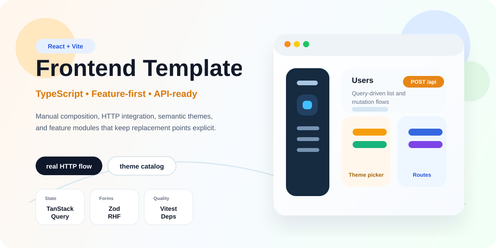
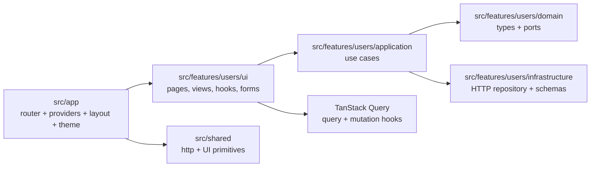
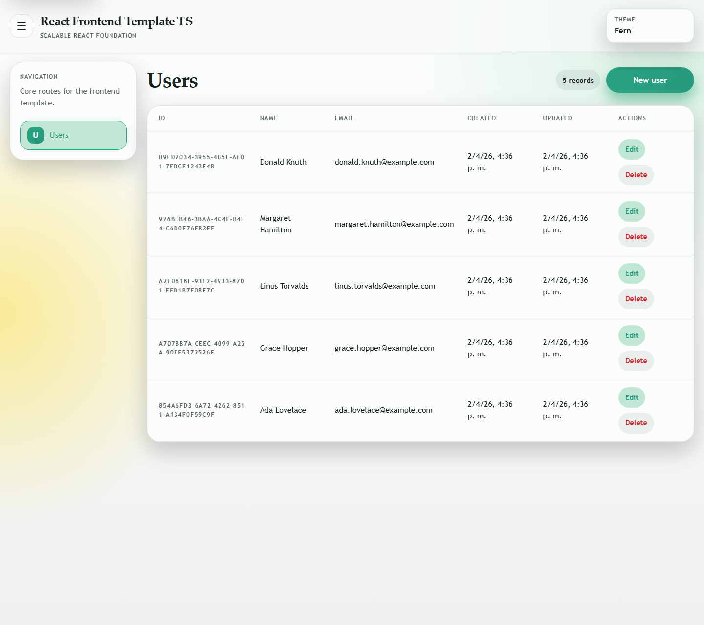
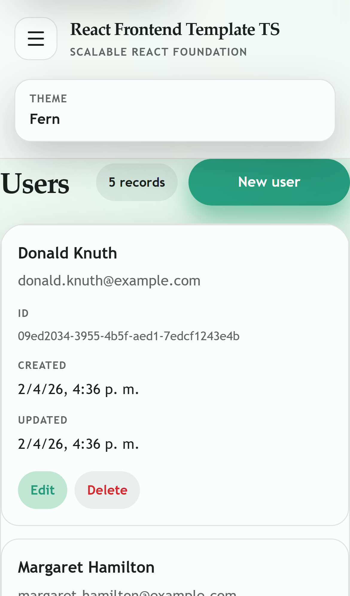
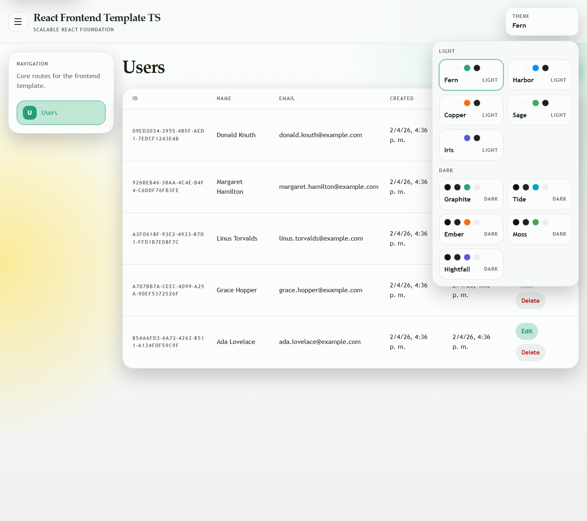
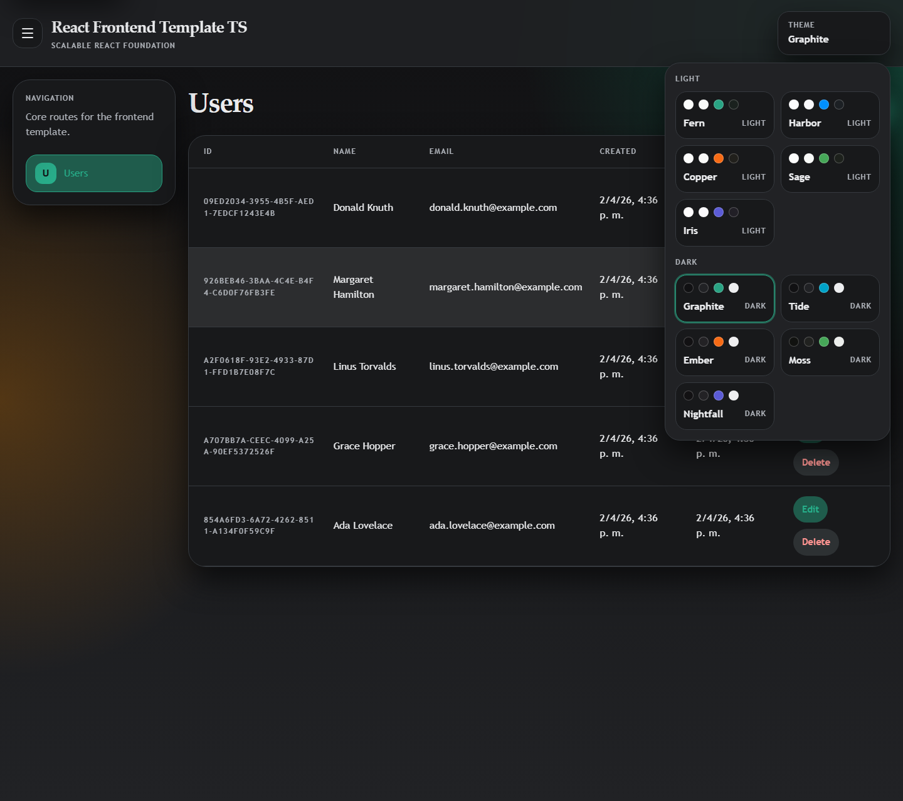

<p align="center">
  
</p>

<h1 align="center">React Frontend Template in TypeScript</h1>

<p align="center">
  Scalable React frontend foundation with strict TypeScript, feature-first architecture, manual composition, replaceable adapters, and a theme catalog built on semantic tokens.
</p>

<p align="center">
  
  
  
  
  
</p>

<p align="center">
  
  
  
</p>

<p align="center">
  <a href="#architecture-at-a-glance">Architecture</a> •
  <a href="#real-ui-preview">Real UI</a> •
  <a href="#theme-selector">Theme Selector</a> •
  <a href="#english">English</a> •
  <a href="#espanol">Español</a>
</p>

| Focus                          | Runtime                                       | Example integration                       | Quality gates                                               |
|--------------------------------|-----------------------------------------------|-------------------------------------------|-------------------------------------------------------------|
| API-connected React foundation | Bun-first local workflow, Docker-ready output | Real `users` HTTP flow against a REST API | ESLint, dependency-cruiser, Vitest, dprint, `100%` coverage |

## Architecture At A Glance



## Real UI Preview

<table>
  <tr>
    <td width="70%" valign="top">
      <strong>Desktop</strong><br />
      
    </td>
    <td width="30%" valign="top">
      <strong>Mobile</strong><br />
      
    </td>
  </tr>
</table>

## Theme Selector

<table>
  <tr>
    <td width="50%" valign="top">
      <strong>Light theme</strong><br />
      
    </td>
    <td width="50%" valign="top">
      <strong>Dark theme</strong><br />
      
    </td>
  </tr>
</table>

<a id="english"></a>
<details open>
<summary><strong>English</strong></summary>

> **Note:** The template is designed to consume a real HTTP API, not behave like an isolated demo frontend.

Scalable React frontend template with strict TypeScript, feature-first architecture, explicit boundaries, and replaceable adapters.
It is intended to consume a real HTTP API, not behave like an isolated demo frontend.

The template keeps React dependencies current but avoids introducing unnecessary layers or magic containers.
Composition is manual, feature ownership is explicit, and the first included feature already talks to a concrete REST API through real HTTP calls.

### Quick Facts

| Area                   | Details                                                           |
|------------------------|-------------------------------------------------------------------|
| Repository goal        | Start from a frontend that already models a real HTTP integration |
| Architectural boundary | `app` -> `features/<feature>` -> `shared`                         |
| Example feature        | `users` with query/mutation hooks against a REST API              |
| Visual direction       | Theme catalog with semantic tokens and multiple palettes          |

### What Is Included

- Feature-first structure with `app`, `shared`, and `features/<feature>` modules
- Internal feature layers: `domain`, `application`, `infrastructure`, and `ui`
- Manual dependency composition, without hidden service locators
- React Router setup at app level
- Base `404` route and route error boundary
- Docker support with Bun build stage and Caddy runtime
- App-level theme system with semantic color tokens and a visual palette selector
- Theme palettes built from Radix Colors scales
- TanStack Query for server state
- React Hook Form and Zod for forms and validation
- HTTP adapter abstraction with a concrete `fetch` implementation
- Complete working `users` example connected to a concrete users REST API
- ESLint, `eslint-plugin-boundaries`, dependency-cruiser, Vitest, and dprint
- Coverage thresholds fixed at `100%`

### Stack

| Runtime                                      | State and routing                | Validation               | Quality                                                                                                 |
|----------------------------------------------|----------------------------------|--------------------------|---------------------------------------------------------------------------------------------------------|
| `Bun`, `React 19`, `Vite`, `Docker`, `Caddy` | `React Router`, `TanStack Query` | `Zod`, `React Hook Form` | `Vitest`, `React Testing Library`, `ESLint`, `dependency-cruiser`, `eslint-plugin-boundaries`, `dprint` |

### Structure

```text
src/
  app/
    composition/
    config/
    layout/
    providers/
    router/
    styles/
    theme/
  shared/
    http/
    ui/
  features/
    users/
      domain/
      application/
      infrastructure/
      ui/
tests/
  unit/
  ui/
```

### Layers

#### App

This is the global composition area. It owns app-wide wiring, providers, router setup, and environment configuration.
In the template:

- `createAppDependencies.ts` wires adapters and use cases
- `AppProviders.tsx` mounts Query, Router, and theme providers
- `createAppRouter.tsx` assembles routes
- app-level routing includes a baseline `404` route and route error boundary
- `layout/` owns the global app shell, header, and sidebar navigation
- `env.ts` centralizes frontend runtime configuration
- `theme/` centralizes semantic palettes and global theme behavior

#### Shared

This area contains generic building blocks with no business ownership.
In the template:

- `FetchHttpClient` is the default HTTP adapter
- `HttpClient` is the low-level port
- `Button` and `TextField` are shared UI primitives

Shared code should stay reusable and must not absorb feature business rules.

#### Feature Domain

This is where business-facing feature types and ports live.
It must not depend on React, browser APIs, routing, forms, or HTTP libraries.
In the example:

- `User` is the feature entity shape
- `UsersRepository` is the port used by the application layer
- sorting logic stays inside the feature domain

#### Feature Application

This layer coordinates use cases and depends on domain contracts, not concrete adapters.
In the example:

- `CreateUser`
- `ListUsers`
- `UpdateUser`
- `DeleteUser`

This is where orchestration belongs when the behavior is not purely visual.

#### Feature Infrastructure

This layer implements concrete adapters and validates external inputs at the boundary.
In the template:

- `HttpUsersRepository` implements the `UsersRepository` port
- Zod schemas validate backend payloads before they move deeper into the app

#### Feature UI

This layer contains pages, feature hooks, form binding, and presentational components.
In the example:

- `useUsersQuery` handles server reads through TanStack Query
- `useCreateUserMutation`, `useUpdateUserMutation`, and `useDeleteUserMutation` handle server writes
- `useUsersPage` coordinates form state and feature behavior
- `UsersPage` is the route entry point
- `UsersView` is the presentational component

### How To Run It

```bash
cp .env.example .env
bun install
bun run dev
```

Available scripts:

| Purpose          | Command                 |
|------------------|-------------------------|
| Install          | `bun install`           |
| Dev server       | `bun run dev`           |
| Production build | `bun run build`         |
| Preview build    | `bun run preview`       |
| Tests            | `bun run test`          |
| Coverage         | `bun run test:coverage` |
| Lint             | `bun run lint`          |
| Format check     | `bun run format`        |
| Format write     | `bun run format:write`  |

### Docker

The repository includes a multi-stage `Dockerfile`.

| Stage        | Runtime                        |
|--------------|--------------------------------|
| Build        | `Bun`                          |
| Runtime      | `Caddy`                        |
| SPA fallback | configured through `Caddyfile` |

Build example:

```bash
docker build \
  --build-arg VITE_API_BASE_URL=https://api.example.com \
  -t react-frontend-template-ts .
```

Run example:

```bash
docker run --rm -p 8080:80 react-frontend-template-ts
```

The container serves the built frontend on port `80`.
Open `http://localhost:8080`.

### Environment And API Integration

Base `.env.example`:

```env
VITE_API_BASE_URL=http://127.0.0.1:3000
```

Development behavior:

- the frontend uses Vite's dev server proxy
- browser requests stay same-origin from the browser point of view
- Vite forwards `/api/*` and `/health` to the backend
- this avoids CORS problems when the target API does not expose CORS headers

Production behavior:

- the frontend reads `VITE_API_BASE_URL`
- the HTTP adapter points directly to that backend origin
- in Docker, `VITE_API_BASE_URL` is resolved during `docker build`, not at container runtime

### Theme Customization

The template theme catalog lives in `src/app/theme/themes.ts`.
It uses semantic tokens mapped from `@radix-ui/colors`, so you can add or replace palettes without duplicating the whole stylesheet.

Recommended path inside this template:

- keep the selector and token contract
- swap or extend the Radix scales used by each theme
- only change semantic token mapping when the UI really needs a new role

Other useful options, but intentionally not included here by default:

- `Style Dictionary` if you later want a broader design-token pipeline that generates outputs for CSS, TypeScript, and other platforms
- `Mantine` if you later decide to adopt a component library that already includes color-scheme helpers
- `MUI` is intentionally not part of this template

### Example API Contract

The included `users` feature expects the following REST endpoints by default:

```http
GET    /api/v1/users
POST   /api/v1/users
PUT    /api/v1/users/:id
DELETE /api/v1/users/:id
```

Frontend route example:

```text
/users
```

Expected create payload:

```json
{
    "name": "Jane Doe",
    "email": "jane.doe@example.com"
}
```

Expected user shape:

```json
{
    "id": "uuid",
    "name": "Jane Doe",
    "email": "jane.doe@example.com",
    "createdAt": "2026-03-21T09:30:00.000Z",
    "updatedAt": "2026-03-21T09:30:00.000Z"
}
```

### How To Extend The Template

1. Create a new feature under `src/features/<feature>`.
2. Put business-facing types and ports in `domain`.
3. Add use cases in `application`.
4. Implement concrete adapters in `infrastructure`.
5. Add feature hooks, forms, pages, and views in `ui`.
6. Wire dependencies in `src/app/composition/createAppDependencies.ts`.
7. Export feature routes from `src/features/<feature>/index.ts`.
8. Assemble the routes in `src/app/router/createAppRouter.tsx`.

For a backend-connected feature, the expected direction is:

1. Define the repository port in the feature domain.
2. Create use cases against that port.
3. Implement the HTTP repository in feature infrastructure.
4. Consume the use cases from query/mutation hooks.
5. Keep pages thin and let the view stay presentational.

### What To Replace In A Real Project

- `HttpUsersRepository` with your real feature adapters if the backend contract changes
- the `users` feature with your real product modules
- shared UI primitives with your own design system wrappers if needed
- the provided theme catalog with your own brand palettes or design tokens
- the current `fetch` adapter with another HTTP client if that becomes necessary
- the demo visual copy with your actual product language

### Design Decisions

- the structure is feature-first because frontend codebases drift into flat global folders very easily
- feature layers are explicit so boundaries are visible early
- the theme system uses semantic tokens so many palettes can exist without duplicating full CSS blocks
- TanStack Query owns server state instead of ad hoc `useEffect` fetching
- React Hook Form owns form state instead of custom local plumbing
- Zod validation happens at input boundaries, not scattered through components
- dependencies are wired manually to keep replacement points obvious
- the example talks to a real backend contract so the template proves frontend-backend integration from the first commit
- test-only resets, fixtures, mocks, and similar helpers stay in `tests/**` or test setup, not in `src/**`, unless they are real runtime dependency boundaries
- runtime code should clean up listeners, subscriptions, timers, query side effects, and similar resources, and should avoid unbounded app-level caches or stores unless that boundary is intentional

### Optional Architectural Decisions

- route or feature lazy loading is intentionally left as a decision for template adopters. It is a common practice and becomes valuable when route count or bundle size grows, but it is not forced into the initial foundation when the app is still small.

</details>

<a id="espanol"></a>
<details>
<summary><strong>Español</strong></summary>

> **Nota:** El template está pensado para consumir una API HTTP real, no como una demo frontend aislada.

Template de frontend escalable con React, TypeScript estricto, arquitectura feature-first, límites explícitos y adapters reemplazables.
Está pensado para consumir una API HTTP real, no como una demo frontend aislada.

El template mantiene dependencias actuales del ecosistema React, pero evita capas innecesarias o contenedores mágicos.
La composición es manual, la pertenencia por feature es explícita y la primera feature incluida ya consume una API REST concreta por HTTP real.

### Resumen Rápido

| Área                     | Detalle                                                            |
|--------------------------|--------------------------------------------------------------------|
| Objetivo del repositorio | Arrancar desde un frontend que ya modele una integración HTTP real |
| Límite arquitectónico    | `app` -> `features/<feature>` -> `shared`                          |
| Feature de ejemplo       | `users` con hooks de query/mutation contra una API REST            |
| Dirección visual         | Catálogo de temas con tokens semánticos y múltiples paletas        |

### Qué Incluye

- Estructura feature-first con módulos `app`, `shared` y `features/<feature>`
- Capas internas por feature: `domain`, `application`, `infrastructure` y `ui`
- Composición manual de dependencias, sin service locators ocultos
- Router con React Router a nivel app
- Ruta base `404` y route error boundary
- Soporte Docker con stage de build en Bun y runtime en Caddy
- Sistema de temas a nivel app con tokens semánticos y selector visual de paletas
- Paletas de tema construidas a partir de escalas de Radix Colors
- TanStack Query para server state
- React Hook Form y Zod para formularios y validación
- Abstracción de cliente HTTP con implementación concreta basada en `fetch`
- Ejemplo funcional completo con `users`, conectado a una API REST concreta de usuarios
- ESLint, `eslint-plugin-boundaries`, dependency-cruiser, Vitest y dprint
- Thresholds de cobertura fijados en `100%`

### Stack

| Runtime                                      | Estado y routing                 | Validación               | Calidad                                                                                                 |
|----------------------------------------------|----------------------------------|--------------------------|---------------------------------------------------------------------------------------------------------|
| `Bun`, `React 19`, `Vite`, `Docker`, `Caddy` | `React Router`, `TanStack Query` | `Zod`, `React Hook Form` | `Vitest`, `React Testing Library`, `ESLint`, `dependency-cruiser`, `eslint-plugin-boundaries`, `dprint` |

### Estructura

```text
src/
  app/
    composition/
    config/
    layout/
    providers/
    router/
    styles/
    theme/
  shared/
    http/
    ui/
  features/
    users/
      domain/
      application/
      infrastructure/
      ui/
tests/
  unit/
  ui/
```

### Capas

#### App

Es el área de composición global. Acá viven el wiring general, los providers, el router y la configuración de entorno.
En el template:

- `createAppDependencies.ts` conecta adapters y casos de uso
- `AppProviders.tsx` monta Query, Router y theming global
- `createAppRouter.tsx` arma las rutas
- el routing de app incluye una base de `404` y route error boundary
- `layout/` es dueño del shell global de la app, el header y la navegación lateral
- `env.ts` centraliza la configuración runtime del frontend
- `theme/` centraliza paletas semánticas y el comportamiento global del selector

#### Shared

Acá van piezas genéricas sin dueño de negocio.
En el template:

- `FetchHttpClient` es el adapter HTTP por defecto
- `HttpClient` es el puerto de bajo nivel
- `Button` y `TextField` son primitivas UI compartidas

`shared` debe seguir siendo reutilizable y no absorber reglas de negocio de features.

#### Feature Domain

Acá viven los tipos y puertos de negocio de una feature.
No debe depender de React, APIs del navegador, routing, formularios ni librerías HTTP.
En el ejemplo:

- `User` es la entidad de la feature
- `UsersRepository` es el puerto que usa application
- la lógica de ordenamiento queda dentro del dominio de la feature

#### Feature Application

Coordina casos de uso y depende de contratos del dominio, no de adapters concretos.
En el ejemplo:

- `CreateUser`
- `ListUsers`
- `UpdateUser`
- `DeleteUser`

Acá va la orquestación cuando el comportamiento no es meramente visual.

#### Feature Infrastructure

Implementa adapters concretos y valida entradas externas en el borde.
En el template:

- `HttpUsersRepository` implementa el puerto `UsersRepository`
- los schemas con Zod validan payloads del backend antes de que entren más profundo en la app

#### Feature UI

Contiene páginas, hooks de feature, binding de formularios y componentes presentacionales.
En el ejemplo:

- `useUsersQuery` resuelve lecturas remotas con TanStack Query
- `useCreateUserMutation`, `useUpdateUserMutation` y `useDeleteUserMutation` resuelven escrituras remotas
- `useUsersPage` coordina formulario y comportamiento de la feature
- `UsersPage` es la entrada de ruta
- `UsersView` es el componente presentacional

### Cómo Correrlo

```bash
cp .env.example .env
bun install
bun run dev
```

Scripts disponibles:

| Propósito            | Comando                 |
|----------------------|-------------------------|
| Instalar             | `bun install`           |
| Dev server           | `bun run dev`           |
| Build de producción  | `bun run build`         |
| Preview              | `bun run preview`       |
| Tests                | `bun run test`          |
| Cobertura            | `bun run test:coverage` |
| Lint                 | `bun run lint`          |
| Check de formato     | `bun run format`        |
| Escritura de formato | `bun run format:write`  |

### Docker

El repositorio incluye un `Dockerfile` multi-stage.

| Stage           | Runtime                          |
|-----------------|----------------------------------|
| Build           | `Bun`                            |
| Runtime         | `Caddy`                          |
| Fallback de SPA | configurado mediante `Caddyfile` |

Ejemplo de build:

```bash
docker build \
  --build-arg VITE_API_BASE_URL=https://api.example.com \
  -t react-frontend-template-ts .
```

Ejemplo de ejecución:

```bash
docker run --rm -p 8080:80 react-frontend-template-ts
```

El contenedor sirve el frontend compilado en el puerto `80`.
Abrí `http://localhost:8080`.

### Entorno E Integración Con API

Base de `.env.example`:

```env
VITE_API_BASE_URL=http://127.0.0.1:3000
```

Comportamiento en desarrollo:

- el frontend usa el proxy del dev server de Vite
- desde el navegador, las requests siguen siendo same-origin
- Vite reenvía `/api/*` y `/health` hacia el backend
- esto evita problemas de CORS cuando la API de destino no expone headers CORS

Comportamiento en producción:

- el frontend lee `VITE_API_BASE_URL`
- el adapter HTTP apunta directamente a ese origen de backend
- en Docker, `VITE_API_BASE_URL` se resuelve durante `docker build`, no en runtime del contenedor

### Personalización De Temas

El catálogo de temas del template vive en `src/app/theme/themes.ts`.
Usa tokens semánticos mapeados desde `@radix-ui/colors`, así que podés sumar o reemplazar paletas sin duplicar toda la hoja de estilos.

Camino recomendado dentro de este template:

- mantener el selector y el contrato de tokens
- cambiar o extender las escalas de Radix usadas por cada tema
- tocar el mapeo de tokens semánticos solo cuando la UI realmente necesite un nuevo rol

Otras opciones útiles, pero que no forman parte del template por defecto:

- `Style Dictionary` si más adelante querés un pipeline de design tokens que genere salidas para CSS, TypeScript y otras plataformas
- `Mantine` si más adelante decidís adoptar una librería de componentes que ya trae helpers de color schemes
- `MUI` está intencionalmente fuera de este template

### Contrato De Ejemplo Con API

La feature `users` incluida espera por defecto los siguientes endpoints REST:

```http
GET    /api/v1/users
POST   /api/v1/users
PUT    /api/v1/users/:id
DELETE /api/v1/users/:id
```

Ruta frontend de ejemplo:

```text
/users
```

Payload esperado para crear:

```json
{
    "name": "Jane Doe",
    "email": "jane.doe@example.com"
}
```

Forma esperada del usuario:

```json
{
    "id": "uuid",
    "name": "Jane Doe",
    "email": "jane.doe@example.com",
    "createdAt": "2026-03-21T09:30:00.000Z",
    "updatedAt": "2026-03-21T09:30:00.000Z"
}
```

### Cómo Extender El Template

1. Crear una nueva feature en `src/features/<feature>`.
2. Poner tipos y puertos de negocio en `domain`.
3. Agregar casos de uso en `application`.
4. Implementar adapters concretos en `infrastructure`.
5. Agregar hooks, formularios, páginas y vistas en `ui`.
6. Registrar dependencias en `src/app/composition/createAppDependencies.ts`.
7. Exportar rutas desde `src/features/<feature>/index.ts`.
8. Ensamblar esas rutas en `src/app/router/createAppRouter.tsx`.

Para una feature conectada al backend, la dirección esperada es:

1. Definir el puerto de repositorio en el dominio de la feature.
2. Crear casos de uso contra ese puerto.
3. Implementar el repositorio HTTP en infrastructure.
4. Consumir esos casos de uso desde hooks de query/mutation.
5. Mantener las páginas finas y la vista como componente presentacional.

### Qué Reemplazar En Un Proyecto Real

- `HttpUsersRepository` por tus adapters reales si cambia el contrato backend
- la feature `users` por tus módulos reales de producto
- las primitivas UI compartidas por wrappers de tu propio sistema de diseño si hace falta
- el catálogo de temas incluido por tus propias paletas o design tokens de marca
- el adapter actual basado en `fetch` por otro cliente HTTP si realmente lo necesitás
- el copy visual de ejemplo por el lenguaje real del producto

### Decisiones De Diseño

- la estructura es feature-first porque en frontend es muy fácil degradar a carpetas globales planas
- las capas por feature son explícitas para que los límites se vean desde temprano
- el sistema de temas usa tokens semánticos para permitir muchas paletas sin duplicar bloques completos de CSS
- TanStack Query es dueño del server state en vez de fetches ad hoc con `useEffect`
- React Hook Form es dueño del estado del formulario en vez de wiring local improvisado
- la validación con Zod ocurre en los bordes de entrada, no dispersa dentro de componentes
- las dependencias se conectan manualmente para que los puntos de reemplazo sean obvios
- el ejemplo consume un contrato backend real para que el template demuestre integración frontend-backend desde el primer commit
- los resets, fixtures, mocks y helpers equivalentes exclusivos de testing van en `tests/**` o en el setup de pruebas, no en `src/**`, salvo que sean límites reales de dependencias de runtime
- el código de runtime debe limpiar listeners, suscripciones, timers, efectos equivalentes de queries y recursos similares, y debe evitar caches o stores globales sin cota salvo que ese límite sea intencional

### Decisiones Opcionales De Arquitectura

- el lazy loading por ruta o feature queda intencionalmente como una decisión de quien adopte el template. Es una práctica común y valiosa cuando crecen la cantidad de rutas o el tamaño del bundle, pero no se fuerza en la base inicial cuando la app todavía es pequeña.

</details>
